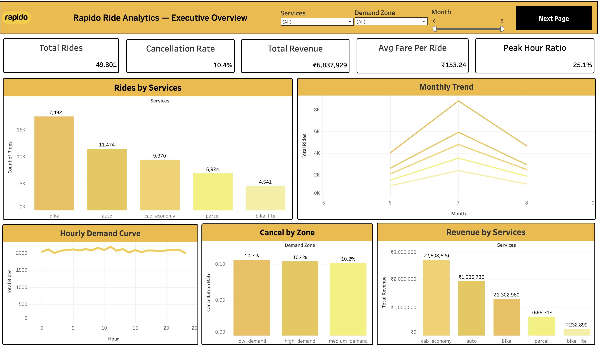
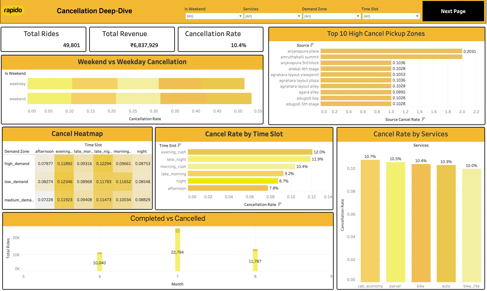
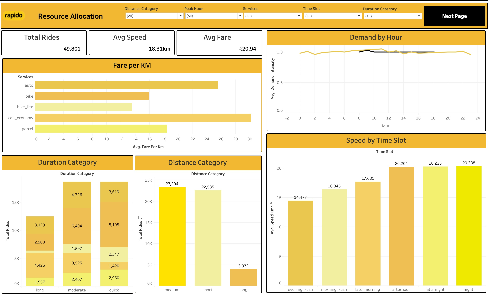
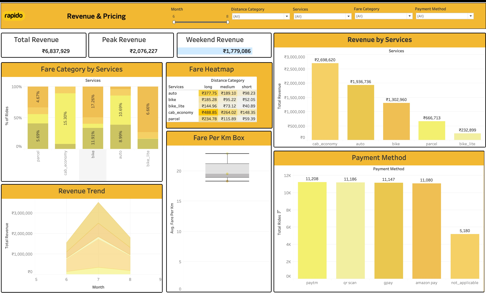

# Tableau Dashboard Links

## Live Interactive Dashboard

Click the badge below to open the full interactive Tableau Public dashboard:

**Direct Link:** [Rapido Rides Analysis — Overview](https://public.tableau.com/views/Rapido_Rides_Analysis_17780461220670/Overview?:language=en-US&:display_count=n&:origin=viz_share_link)

---

## Dashboard Previews

| Screenshot | Description |
| :--- | :--- |
|  | Overview — Cancellation Rate & Revenue KPIs |
|  | Demand vs. Cancellation by Zone |
|  | Peak Hour Analysis by Service Type |
|  | Revenue Leakage & Recovery Opportunities |

---

## Dashboard Highlights

- **Executive View**: Summary KPIs — total revenue (₹6.8M), cancellation rate (10.4%), and average fare per ride (₹153.24).
- **Demand vs. Cancellation**: Scatter view of high-demand zones where driver supply bottlenecks drive cancellations.
- **Peak Hour Breakdown**: Cancellation spikes of 15–20% during 8–10 AM and 5–7 PM, segmented by service type.
- **Revenue Recovery Simulation**: Reducing cancellations in the top 5 hotspots by 10% recovers ~₹1,20,000/month.
